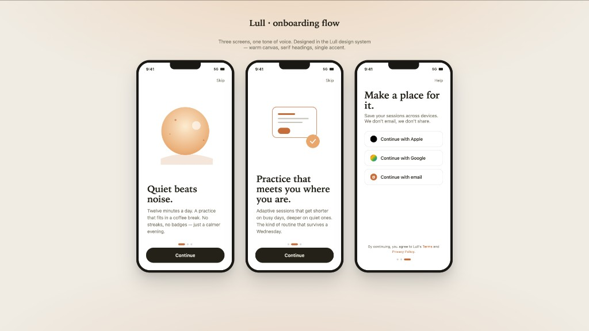
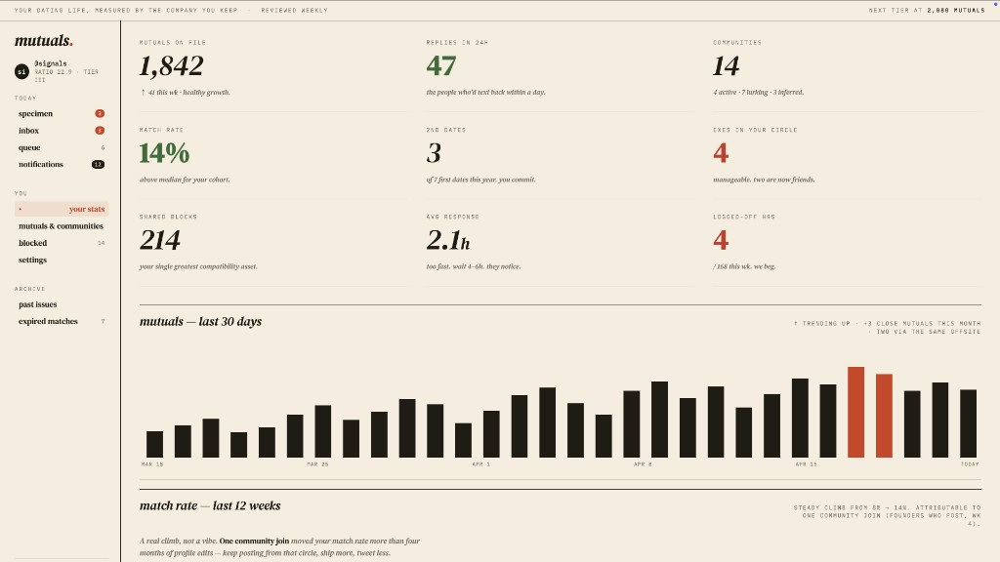
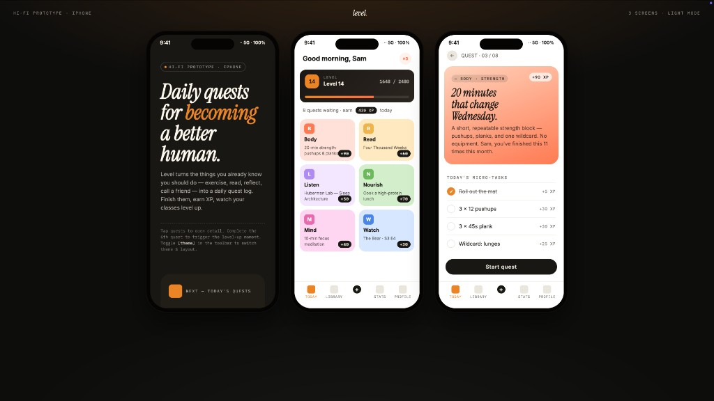
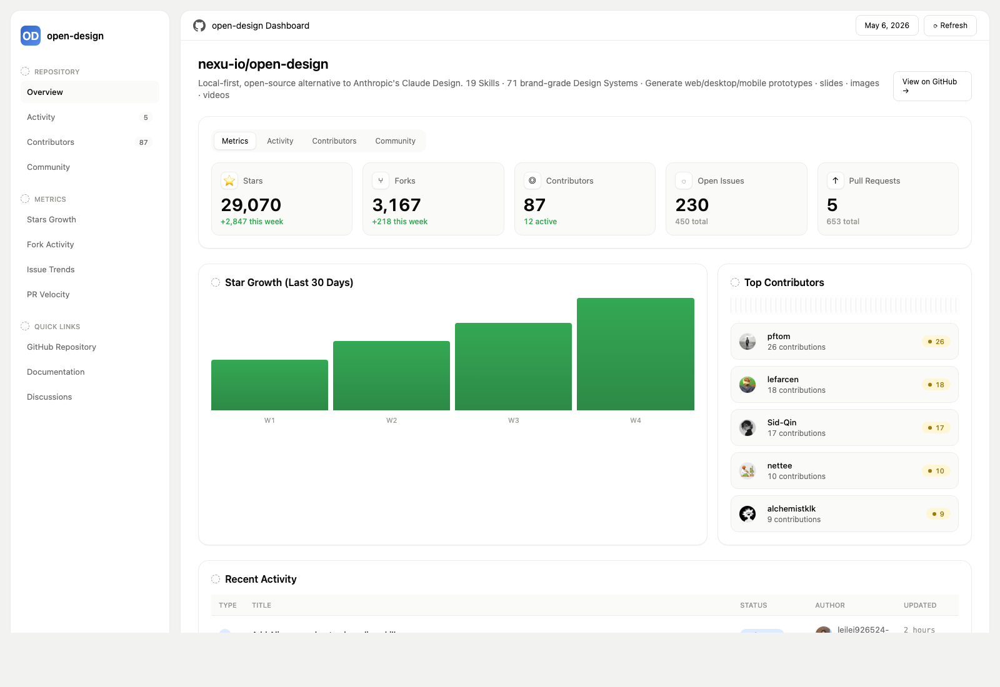
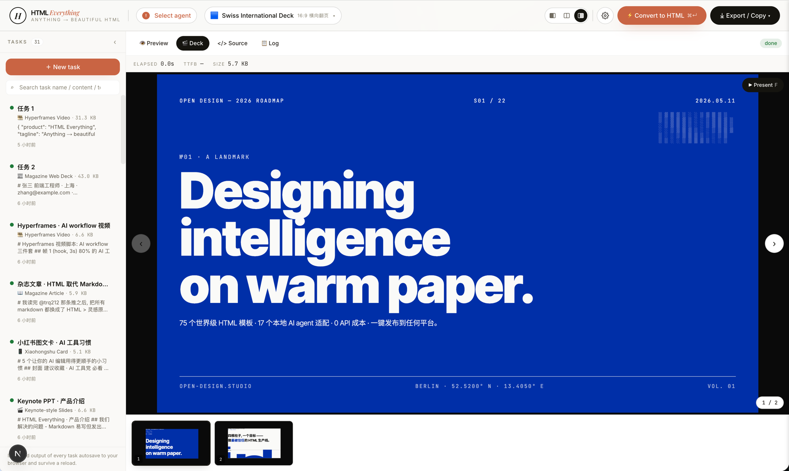

<h1 align="center">Readable Studio</h1>

<p align="center"><b>Turn source text into polished, directly editable business documents.</b></p>

Readable Studio is for office workers creating reports, briefs, presentations, plans, and other documents as their organizations move through enterprise AI transformation.

The canonical workflow is:

**source text -> AI generation -> PowerPoint-like direct editing -> polished standalone HTML**

Start with existing business material rather than a blank canvas. AI generation structures and designs the first draft. Then select content in the preview and edit it directly instead of returning to a prompt for every small revision. The finished deliverable is a self-contained HTML document that opens independently and preserves its presentation.

Readable Studio does not depend on automatic publishing or an online destination. This brief makes no promise for formats beyond the standalone HTML workflow.

<p align="center"><b>English</b> · <a href="docs/i18n/README.es.md">Español</a> · <a href="docs/i18n/README.pt-BR.md">Português</a> · <a href="docs/i18n/README.de.md">Deutsch</a> · <a href="docs/i18n/README.fr.md">Français</a> · <a href="docs/i18n/README.zh-CN.md">简体中文</a> · <a href="docs/i18n/README.zh-TW.md">繁體中文</a> · <a href="docs/i18n/README.ko.md">한국어</a> · <a href="docs/i18n/README.ja-JP.md">日本語</a> · <a href="docs/i18n/README.ar.md">العربية</a> · <a href="docs/i18n/README.ru.md">Русский</a> · <a href="docs/i18n/README.uk.md">Українська</a> · <a href="docs/i18n/README.tr.md">Türkçe</a></p>

---

## What is Readable Studio

Readable Studio combines an AI document workflow with familiar visual control. It grounds generation in the user's source documents, keeps the resulting HTML available for direct editing, and produces a polished standalone HTML deliverable.

Its differentiator is the handoff between generation and editing: AI creates the structured first draft, while PowerPoint-like direct editing lets the user revise text, hierarchy, spacing, and presentation details in place. The user remains the editor of the document rather than the operator of a prompt loop.

---

## Product tour

A quick look at what Open Design is and what it does. Start from **Home**, orchestrate repeat workflows with **Automation**, distill a brand contract in **Design System**, and extend with **Plugins** and **integrations**; inside any project's **Studio**, the same design system streams out prototypes, dashboards, artifacts, and decks.

### Core pages

<table>
<tr>
<td valign="top">
<br/>
<sub><b>Home</b> — the overview entry point. Pick a skill and a design system, type the brief, and kick off everything from one place.</sub>
</td>
</tr>
</table>

<table>
<tr>
<td width="50%" valign="top">
<br/>
<sub><b>Automation</b> — orchestrate repetitive design workflows into reusable, schedulable automations.</sub>
</td>
<td width="50%" valign="top">
<br/>
<sub><b>Design System</b> — distill your team's <code>DESIGN.md</code> into a brand contract that shapes every output.</sub>
</td>
</tr>
<tr>
<td width="50%" valign="top">
<br/>
<sub><b>Plugin</b> — browse, install, and distribute workflow plugins to extend generation on demand.</sub>
</td>
<td width="50%" valign="top">
<br/>
<sub><b>Integrations</b> — connect external systems and MCP tools, and use Open Design from any IDE, script, or automation.</sub>
</td>
</tr>
</table>

### Studio — project artifacts in one place

Inside a project's Studio, the active design system drives prototypes, decks, dashboards, and project files. Artifacts render in a sandboxed iframe and can be exported as HTML, PDF, PPTX, ZIP, or Markdown.

---
## Platform Compatibility

> Open Design ships as **skills, a CLI, and an MCP server** that mainstream coding agents consume natively. Once OD is installed, a single `readable mcp install <agent>` wires the MCP server into that agent's config, and you call the same tools from inside any agent.

| Coding agent / platform &nbsp;&nbsp;&nbsp;&nbsp;&nbsp;&nbsp;&nbsp;&nbsp; | Status &nbsp;&nbsp; | One-line MCP server install &nbsp;&nbsp;&nbsp;&nbsp;&nbsp;&nbsp;&nbsp;&nbsp;&nbsp;&nbsp;&nbsp;&nbsp;&nbsp;&nbsp;&nbsp;&nbsp;&nbsp;&nbsp; |
|---|:---:|---|
| [Claude Code](https://docs.anthropic.com/en/docs/claude-code) | ✅ Supported | `readable mcp install claude` |
| [Codex CLI](https://github.com/openai/codex) | ✅ Supported | `readable mcp install codex` |
| [Cursor](https://www.cursor.com/cli) | ✅ Supported | `readable mcp install cursor` |
| [VS Code + GitHub Copilot](https://github.com/features/copilot) | ✅ Supported | `readable mcp install copilot` |
| [GitHub Copilot CLI](https://github.com/features/copilot/cli) | ✅ Supported | `readable mcp install copilot` |
| Gemini CLI | ✅ Supported | `readable mcp install gemini` |
| [OpenCode](https://opencode.ai/) | ✅ Supported | `readable mcp install opencode` |
| [OpenClaw](https://github.com/openclaw/openclaw) | ✅ Supported | `readable mcp install openclaw` |
| [Antigravity](https://antigravity.google) | ✅ Supported | `readable mcp install antigravity` |
| [Cline](https://github.com/cline/cline) | ✅ Supported | `readable mcp install cline` |
| [Trae](https://www.trae.ai/) | ✅ Supported | `readable mcp install trae` |
| Kimi CLI | ✅ Supported | `readable mcp install kimi` |
| [Pi Agent](https://github.com/badlogic/pi-mono) | ✅ Supported | `readable mcp install pi` |
| [Mistral Vibe CLI](https://github.com/mistralai/mistral-vibe) | ✅ Supported | `readable mcp install vibe` |
| [Hermes Agent](https://github.com/nousresearch/hermes-agent) | ✅ Supported | `readable mcp install hermes` |

`readable mcp install <agent> --print` for a dry-run preview · `--uninstall` to remove · full list with `readable mcp install --help`.

<p align="center">
  
</p>

**No CLI installed?** The BYOK proxy at `POST /api/proxy/{anthropic,openai,azure,google,ollama,senseaudio}/stream` gives you the same loop (no process spawn) — paste `baseUrl` + `apiKey` + `model`, with support for OpenAI, Anthropic, Azure OpenAI, Google Gemini, Ollama, LM Studio, vLLM, or any OpenAI-compatible endpoint. Per-target SSRF protection blocks internal IPs / link-local / CGNAT at the daemon edge.

The adapter contract and stream parsers live in [`apps/daemon/src/agents.ts`](apps/daemon/src/agents.ts). Adding a new CLI is one entry — see [`docs/agent-adapters.md`](docs/agent-adapters.md).

---

## Demo

Four core product categories, all rendered by a coding agent running on your laptop. Click a thumbnail to see the real example.

### 1 · Prototypes — web · desktop · mobile

The default output surface. Single-page HTML artifacts that read your `DESIGN.md` and render in a sandboxed iframe.

<table>
<tr>
<td width="50%" valign="top">
<br/>
<sub><b>Entry view</b> — pick a skill, pick a design system, type the brief. One surface for prototypes, dashboards, decks, mobile apps, magazine pages.</sub>
</td>
<td width="50%" valign="top">
<br/>
<sub><b>Mobile prototype</b> — pixel-accurate iPhone 15 Pro chrome, multi-screen flows. The agent never redraws the phone frame; shared device frames live in <code>assets/frames/</code>.</sub>
</td>
</tr>
<tr>
<td width="50%" valign="top">
<br/>
<sub><b>Web prototype</b> — an editorial dashboard with scrollbars, KPIs, and charts. Rendered straight from <code>design-templates/dating-web/</code>.</sub>
</td>
<td width="50%" valign="top">
<br/>
<sub><b>Mobile app prototype</b> — a three-screen gamified flow with XP ribbons and quest detail, ready to use as source material for React/Next/Vue.</sub>
</td>
</tr>
</table>

### 2 · Live artifacts & dashboards

Live dashboards, decision rooms, KPI walls — single-page artifacts that pull data through a tweaks panel and stay editable in place.

<table>
<tr>
<td width="50%" valign="top">
<br/>
<sub><b>Live dashboard</b> — an editable KPI wall whose tweaks panel surfaces the parameters worth nudging. The agent emits a manifest, and the iframe re-renders without a reload.</sub>
</td>
<td width="50%" valign="top">
<br/>
<sub><b>Decision room</b> — a multi-source briefing artifact for product / research / ops meetings.</sub>
</td>
</tr>
<tr>
<td width="50%" valign="top">
<br/>
<sub><b>GitHub-style dashboard</b> — repo metrics presented as a live artifact.</sub>
</td>
<td width="50%" valign="top">
<br/>
<sub><b>Flow live-dashboard template</b> — a domain-specific KPI template, branded through the active <code>DESIGN.md</code>.</sub>
</td>
</tr>
</table>

### 3 · Decks — magazine decks, weekly updates, pitches

<table>
<tr>
<td width="50%" valign="top">
<br/>
<sub><b>Deck mode (guizang-ppt)</b> — magazine layouts, WebGL hero, P0/P1/P2 checklists. Bundled verbatim from <a href="https://github.com/op7418/guizang-ppt-skill"><code>op7418/guizang-ppt-skill</code></a> with its original license preserved.</sub>
</td>
<td width="50%" valign="top">
<br/>
<sub><b>Swiss International-style deck</b> — grid-anchored, monochrome accents. One of <b>15 deck templates</b> and <b>36 themes</b> under <code>design-templates/html-ppt-*/</code>.</sub>
</td>
</tr>
</table>

Every deck exports to **HTML** (single file, inlined assets), **PDF** (browser print, deck-aware), **PPTX** (agent-driven skill), **ZIP** (archive), or **Markdown**.

---

## Why Open Design

> **In April 2026, Anthropic released [Claude Design][cd] — the first time an LLM stopped writing prose and started delivering design artifacts directly.** It went viral. But it stayed closed-source, paid-only, cloud-only, locked to Anthropic's model, Anthropic's skills, Anthropic's surface. No checkout, no self-host, no Vercel deploy, no swap-in-your-own-agent.

Open Design (OD) is the open-source alternative. Same loop, same artifact-first mental model, none of the lock-in:

- 🤖 **Agent-native, model-agnostic.** We don't ship an agent. The `claude` / `codex` / `cursor-agent` / `copilot` / `hermes` / `kimi` already on your `PATH` are the design engine. Swap with one click.
- 🧠 **Brand-grade by default.** Every render reads the active `DESIGN.md` — a 9-section schema covering palette, type, spacing, motion, voice, anti-patterns. 150 systems ship with the repo (Linear, Stripe, Vercel, Airbnb, Apple, Tesla, Notion, Anthropic, Cursor, Supabase, Figma…). Drop a folder in, the picker finds it.
- 🖥️ **Local-first project work.** Project files and document state remain available to the local workspace while users generate and refine their material.
- 🌍 **Composable on three planes.** **Plugins** carry runnable workflows · **skills** carry the agent's design taste · **design systems** carry the brand. All three are plain files anyone can author, version, and publish.
- 🔁 **Refresh an existing codebase.** Hand a `git` repo + `DESIGN.md` to the agent and it refactors your real components to the brand spec. Dedicated plugins migrate Figma / Pencil workflows into React / Next.js / Vue code.
- 🔒 **Privacy by conviction.** Everything runs where your data lives — your laptop, your team's server, your Vercel project. When the network is needed, the BYOK proxy is SSRF-guarded.

### Comparison

| | [Claude Design][cd] | Figma | Lovable / v0 / Bolt | **Open Design** |
|---|---|---|---|---|
| Open source | ❌ | ❌ | ❌ | **✅ Apache-2.0** |
| Self-host / desktop | ❌ | ❌ | ❌ | **✅ macOS + Windows + Vercel** |
| Agent-native (runs in your CLI) | Anthropic only | ❌ | Cloud agent only | **✅ 21 CLIs + BYOK** |
| Brand-grade `DESIGN.md` | Proprietary | Theme JSON | Limited tokens | **✅ 150 systems shipped** |
| Skills / plugins / templates | Closed | Plugin store | Closed | **✅ 100+ skills · 261 plugins** |
| Refresh an existing repo to brand | ❌ | ❌ | ❌ | **✅ via agent + `DESIGN.md`** |
| Minimum billing | Pro / Max / Team | Pro / Org | Pro / Team | **BYOK · any compatible endpoint** |

---

## Quick start

### 🖥️ Download the desktop app (recommended — zero config)

The fastest way to use Open Design. No Node, no pnpm, no clone.

- **macOS** (Apple Silicon · Intel x64) → [**open-design.ai**](https://open-design.ai/) or [GitHub Releases](https://github.com/sanghyunna/readable-studio/releases)
- **Windows** (x64) → [**open-design.ai**](https://open-design.ai/) or [GitHub Releases](https://github.com/sanghyunna/readable-studio/releases)
- **Linux** (AppImage, optional lane) → [GitHub Releases](https://github.com/sanghyunna/readable-studio/releases)

After install: the app auto-detects every coding-agent CLI on your `PATH`, loads 100+ skills and 150 design systems, and lets you type a brief in the entry view.

### 🤖 Install into your coding agent (no UI)

You can use Open Design without ever opening the GUI — call it as a skill, plugin, or MCP server inside Claude Code, Codex, Cursor, Copilot, OpenClaw, Antigravity, Hermes, Kimi, and more.

```bash
# One-line install into the agent you're using:
curl -fsSL https://open-design.ai/install.sh | sh -s <agent>
# <agent> = claude | codex | cursor | copilot | openclaw | antigravity | gemini
#         | pi | vibe | hermes | cline | kimi | trae | opencode
```

Then, inside the agent:

```
> Use open-design to generate a landing page with the Linear design system
```

The agent reads `skills/`, picks the right `SKILL.md`, binds the `DESIGN.md` you named, and emits an `<artifact>` previewable at `http://localhost:7456`.

### 🧑‍💻 Run from source

```bash
git clone https://github.com/sanghyunna/readable-studio.git readable-studio
cd readable-studio
corepack enable && pnpm install
pnpm tools-dev run web
```

Node `~24`, pnpm `10.33.x`. Windows users, see [`docs/windows-troubleshooting.md`](docs/windows-troubleshooting.md). Full quickstart, env vars, and packaged build flow → [`QUICKSTART.md`](QUICKSTART.md).

### A full workflow — from brief to artifact

`brief → plugin → direction → design system → artifact → engineering → memory`

1. **A PM submits a brief.** The plugin picker offers landing page · pitch deck · dashboard · social post · PM spec · OKR scorecard…
2. **A designer (or the agent) locks the direction.** No brand? Pick from 5 curated directions. Have a brand? Drop a screenshot / URL → the agent connects GitHub, imports Figma, and codifies a reusable `DESIGN.md`.
3. **The agent emits the first `<artifact>`.** Plugin + skill + `DESIGN.md` are bound. It streams into a sandboxed iframe, editable in place — not "regenerate from scratch."
4. **Continue with engineering.** The artifact is real HTML/CSS, ready to use as implementation source material. Or export PPTX / PDF / ZIP straight to marketing.
5. **Open Design gets smarter as you use it.** Your screenshots, fonts, palettes, and confirmed artifacts accumulate as defaults for the next session. Less rework, less drift.

---

## Use Open Design from your coding agent

Open Design ships a **stdio MCP server** and per-agent **install scripts**. Any MCP-compatible agent in another repo can read files from your local Open Design projects directly — tokens CSS, JSX components, entry HTML — as a structured API queryable by name. The agent always sees the live file, not a stale export.

```bash
# One-line install (16+ CLIs supported):
curl -fsSL https://open-design.ai/install.sh | sh -s <agent>

# Then the agent can:
readable search-files "primary button"      # search files across projects
readable get-file design-systems/linear-app/DESIGN.md
readable get-artifact <slug>                # latest rendered artifact
readable plugin run web-prototype --brief "..."
readable skill list --scenario marketing
```

**Why MCP?** Exporting and re-attaching a zip every iteration breaks flow. MCP exposes the design source directly — the agent always sees the live file.

**For an agent starting from scratch,** the installer places `~/.config/<agent>/readable-studio.json` (or the platform equivalent) plus a copy-paste MCP snippet. Cursor gets a one-click deeplink; Claude Code gets a `claude mcp add-json` one-liner; every other agent gets JSON in the schema its config expects. Full per-agent flow → **Settings → MCP server** in the desktop app, or [`docs/agent-adapters.md`](docs/agent-adapters.md).

**Security model.** Read-only by default, the daemon binds to `127.0.0.1`, and SSRF is blocked at the proxy edge. LAN exposure requires an explicit `OD_BIND_HOST` plus `OD_ALLOWED_ORIGINS`. Connector credentials and live-artifact preview routes stay loopback-only regardless.

---

## Skills

**100+ skills ship in the box** — each is a folder under [`skills/`](skills/) following the Claude Code [`SKILL.md`][skill] convention, extended with an `od:` frontmatter (`mode`, `platform`, `scenario`, `preview.type`, `design_system.requires`, `default_for`, `fidelity`, `example_prompt`). Drop a folder in, restart the daemon, it appears in the picker.

Two **modes** anchor the catalog: `prototype` (web/mobile/desktop single-page artifacts) and `deck` (horizontal-swipe presentations). Also `template`, `design-system`, and `utility` modes. The **`scenario`** field groups them by audience: `design` · `marketing` · `operation` · `engineering` · `product` · `finance` · `hr` · `sale` · `personal`.

| Skill | Mode | Scenario | What it produces |
|---|---|---|---|
| [`web-prototype`](design-templates/web-prototype/) | prototype | design | Default landing page / hero |
| [`saas-landing`](design-templates/saas-landing/) | prototype | marketing | Hero / features / pricing / CTA |
| [`dashboard`](design-templates/dashboard/) | prototype | operation | Admin / analytics (with sidebar) |
| [`mobile-app`](design-templates/mobile-app/) | prototype | design | iPhone 15 Pro / Pixel framed app |
| [`mobile-onboarding`](design-templates/mobile-onboarding/) | prototype | design | Splash · value-prop · sign-in flow |
| [`social-carousel`](design-templates/social-carousel/) | prototype | marketing | 3-card 1080×1080 carousel |
| [`email-marketing`](design-templates/email-marketing/) | prototype | marketing | Table-fallback-safe brand email |
| [`magazine-poster`](design-templates/magazine-poster/) | prototype | marketing | Single-page magazine layout |
| [`motion-frames`](design-templates/motion-frames/) | prototype | marketing | Looping CSS motion hero |
| [`sprite-animation`](design-templates/sprite-animation/) | prototype | marketing | 8-bit pixel animated explainer |
| [`pm-spec`](design-templates/pm-spec/) | prototype | product | PM spec doc (with TOC + decision log) |
| [`team-okrs`](design-templates/team-okrs/) | prototype | product | OKR scorecard |
| [`eng-runbook`](design-templates/eng-runbook/) | prototype | engineering | Incident runbook |
| [`finance-report`](design-templates/finance-report/) | prototype | finance | Exec finance summary |
| [`hr-onboarding`](design-templates/hr-onboarding/) | prototype | hr | Role onboarding plan |
| [`guizang-ppt`](design-templates/guizang-ppt/) | deck | marketing | Magazine-style web PPT (deck default) |
| [`html-ppt-*`](design-templates/) | deck | marketing | 15 deck templates × 36 themes (master template in [`design-templates/html-ppt/`](design-templates/html-ppt/)) |
| [`critique`](design-templates/critique/) | utility | design | Five-dimensional self-critique scoresheet |
| [`tweaks`](design-templates/tweaks/) | utility | design | AI-emitted tweaks-panel manifest |

Full skill protocol → [`docs/skills-protocol.md`](docs/skills-protocol.md). Skill registry endpoint: `GET /api/skills`.

---

## Design Systems

**150 brand-grade `DESIGN.md` systems** ship with the repo — each a single Markdown file with a 9-section schema (color, typography, spacing, layout, components, motion, voice, brand, anti-patterns), from [`VoltAgent/awesome-design-md`][acd2]. Switch a system → the next render uses the new tokens. No theme JSON.

<details>
<summary><b>Full catalog (click to expand)</b></summary>

**AI & LLM** — `claude` · `cohere` · `mistral-ai` · `minimax` · `together-ai` · `replicate` · `runwayml` · `elevenlabs` · `ollama` · `x-ai`

**Developer Tools** — `cursor` · `vercel` · `linear-app` · `framer` · `expo` · `clickhouse` · `mongodb` · `supabase` · `hashicorp` · `posthog` · `sentry` · `warp` · `webflow` · `sanity` · `mintlify` · `lovable` · `composio` · `opencode-ai` · `voltagent`

**Productivity** — `notion` · `figma` · `miro` · `airtable` · `superhuman` · `intercom` · `zapier` · `cal` · `clay` · `raycast`

**Fintech** — `stripe` · `coinbase` · `binance` · `kraken` · `mastercard` · `revolut` · `wise`

**E-commerce** — `shopify` · `airbnb` · `uber` · `nike` · `starbucks` · `pinterest`

**Media** — `spotify` · `playstation` · `wired` · `theverge` · `meta`

**Automotive** — `tesla` · `bmw` · `ferrari` · `lamborghini` · `bugatti` · `renault`

**Other** — `apple` · `ibm` · `nvidia` · `vodafone` · `resend` · `spacex`

**Starters** — `default` (Neutral Modern) · `warm-editorial`

</details>

Re-import the library via [`scripts/sync-design-systems.ts`](scripts/sync-design-systems.ts). Add your own brand → drop a `DESIGN.md` into `design-systems/<brand>/`. Full guide → [`design-systems/README.md`](design-systems/README.md).

[acd2]: https://github.com/VoltAgent/awesome-design-md

---

## Plugins

**261 official plugins** live in [`plugins/_official/`](plugins/_official/). Each plugin is a **portable agent-skill folder** — a `SKILL.md` (readable by any agent that supports Agent Skills), plus an optional `readable-studio.json` manifest that gives Open Design marketplace metadata, inputs, previews, pipelines, and capability declarations. Jump straight to a category:

| Category | Count | Contents |
|---|---|---|
| [`scenarios/`](plugins/_official/scenarios/) | 11 | Complete design scenarios — [`od-default`](plugins/_official/scenarios/od-default/), [`od-design-refine`](plugins/_official/scenarios/od-design-refine/), [`od-figma-migration`](plugins/_official/scenarios/od-figma-migration/), [`od-code-migration`](plugins/_official/scenarios/od-code-migration/), [`od-react-export`](plugins/_official/scenarios/od-react-export/), [`od-nextjs-export`](plugins/_official/scenarios/od-nextjs-export/), [`od-vue-export`](plugins/_official/scenarios/od-vue-export/), [`od-media-generation`](plugins/_official/scenarios/od-media-generation/), [`od-new-generation`](plugins/_official/scenarios/od-new-generation/), [`od-tune-collab`](plugins/_official/scenarios/od-tune-collab/), [`od-plugin-authoring`](plugins/_official/scenarios/od-plugin-authoring/) |
| [`image-templates/`](plugins/_official/image-templates/) | 45 | One-shot image prompts — editorial, cinematic, product, portrait |
| [`design-systems/`](plugins/_official/design-systems/) | 142 | Brand `DESIGN.md` wrapped as plugins |
| [`atoms/`](plugins/_official/atoms/) | 13 | Reusable UI fragments (buttons, heroes, KPI cards) |
| [`examples/`](plugins/_official/examples/) | 140 | Remixable reference outputs |

Also [`plugins/community/`](plugins/community/) for community plugins and [`plugins/registry/`](plugins/registry/) for the publishing flow.

### What plugins can do

- 🤖 **Run in any coding agent** — [Claude Code](docs/agent-adapters.md), Codex, Cursor, Copilot, [OpenClaw](https://github.com/openclaw/openclaw), [Antigravity](https://antigravity.google), Hermes, Kimi… through the same skill protocol the agent already knows.
- 🔁 **Migrate Figma / Pencil workflows** → React, Next.js, or Vue source. See [`od-figma-migration`](plugins/_official/scenarios/od-figma-migration/).
- 🛠️ **Refresh an existing codebase to a brand spec** — point a plugin at a `git` repo + `DESIGN.md`, get a PR. See [`od-code-migration`](plugins/_official/scenarios/od-code-migration/).
- 💾 **Persist custom workflows** — your team's reusable templates sit next to the shipped ones.

### Using plugins

Plugins are at full parity across the **web UI** and the **`readable` CLI** — same `/api/plugins` endpoints, pick whichever fits.

**In the desktop / web app:** open the **Plugin** page to browse the marketplace and click **Install**; inside a project's Studio, plugins appear as composer chips you click to apply (with the inputs they declare).

**On the command line** (runs without a UI — this is the path external agents use):

```bash
readable plugin list                       # list installed plugins (--task-kind / --mode / --tag filters)
readable plugin search "landing page"      # search by keyword
readable plugin info od-default            # inspect a plugin's metadata, inputs, capabilities
readable plugin install od-figma-migration # install from a registry; also accepts ./local-folder or an https://… link
readable plugin apply od-default --input brief="a one-page pitch for our seed round"
readable plugin upgrade od-default         # upgrade
readable plugin uninstall od-default       # uninstall
```

Every command supports `--json`, so you can pipe it through `jq` / `xargs` into automation.

### Building a plugin

A plugin **needs only a `SKILL.md` at minimum**; to list it in the Open Design marketplace, add an `readable-studio.json`:

```
my-plugin/
├── SKILL.md            ← required: YAML frontmatter (name · description) + trigger phrasing + workflow (aim for < 500 lines)
├── readable-studio.json    ← needed to list: marketplace metadata + inputs + pipeline + capabilities
├── README.md           ← optional: usage, install, registry links
├── preview/            ← optional: index.html / poster.png (strongly recommended for visual plugins)
└── examples/           ← optional: concrete use cases
```

Core `readable-studio.json` fields: `specVersion` (currently `1.0.0`), `name` (stable ID), `version` (semver), `compat.agentSkills[].path` (points at `./SKILL.md`), `od.kind` (`skill` / `scenario` / `atom` / `bundle`), `od.taskKind` (`new-generation` / `figma-migration` / `code-migration` / `tune-collab`), `od.mode` (the output surface, e.g. `prototype` / `deck` / `live-artifact` / `image` / `video` / `hyperframes` / `audio` / `design-system` / `scenario`), `od.capabilities[]` (**declare the minimum** — a restricted install grants only `prompt:inject` by default), `od.inputs[]` (apply-time parameters).

Scaffold + validate locally:

```bash
readable plugin scaffold --id my-plugin --title "My Plugin"   # generate the skeleton
readable plugin validate ./my-plugin                          # check manifest / file layout
pnpm guard && pnpm --filter @readable-studio/plugin-runtime typecheck
```

Full field set and runtime contract → [`plugins/spec/SPEC.md`](plugins/spec/SPEC.md); developing a plugin with a coding agent → [`plugins/spec/AGENT-DEVELOPMENT.md`](plugins/spec/AGENT-DEVELOPMENT.md); copy-paste minimal templates → [`plugins/spec/examples/`](plugins/spec/examples/).

### Contributing a plugin

1. Drop the plugin folder into [`plugins/community/`](plugins/community/) (third-party plugins), or — to ship it bundled with Open Design — into the matching tier of [`plugins/_official/`](plugins/_official/).
2. Pass validation: `readable plugin validate`, `pnpm guard`, `pnpm --filter @readable-studio/plugin-runtime typecheck`.
3. Fill the PR using the template in [`plugins/spec/CONTRIBUTING.md`](plugins/spec/CONTRIBUTING.md) (ID, version, lane, mode, capabilities, trigger examples; attach a screenshot / preview for visual plugins).
4. To publish to an external registry (skills.sh / ClawHub / standalone GitHub) → [`plugins/spec/PUBLISHING-REGISTRIES.md`](plugins/spec/PUBLISHING-REGISTRIES.md).

Plugin registry endpoint: `GET /api/plugins`. Directory overview → [`plugins/README.md`](plugins/README.md) ([简体中文](plugins/README.zh-CN.md)).

---

## Architecture

```
┌────────────────── browser (Next.js 16) / Electron shell ──────────────┐
│  chat · file workspace · iframe preview · settings · import · MCP     │
└──────────────┬─────────────────────────────────────┬─────────────────┘
               │ /api/*                              │
               ▼                                     ▼
   ┌─────────────────────────────────┐   /api/proxy/{provider}/stream (SSE)
   │  local daemon (Express+SQLite)  │   ─→ any OpenAI-compatible BYOK,
   │                                  │       SSRF-guarded at the edge
   │  /api/skills    /api/plugins    │
   │  /api/design-systems            │
   │  /api/chat (SSE)   /api/proxy/* │
   │  /api/projects/:id/files/...    │
   │  /api/artifacts/{save,lint}     │
   │  /api/import/claude-design      │
   │  MCP stdio server                │
   └─────────┬───────────────────────┘
             │ spawn(cli, [...], { cwd: .od/projects/<id> })
             ▼
   ┌──────────────────────────────────────────────────────────────────┐
   │  claude · codex · cursor-agent · copilot · openclaw · antigravity ·│
   │  gemini · opencode · qwen · qoder · hermes (ACP) · kimi (ACP) ·    │
   │  pi (RPC) · kiro · kilo · vibe (ACP) · cline · trae · deepseek     │
   │  reads SKILL.md + DESIGN.md, writes artifacts to disk             │
   └──────────────────────────────────────────────────────────────────┘
```

| Layer | Stack ||---|---|
| Frontend | Next.js 16 App Router + React 18 + TypeScript |
| Daemon | Node 24 · Express · SSE streaming · `better-sqlite3` |
| Storage | Files at `.od/projects/<id>/` + SQLite at `.od/app.sqlite` + `media-config.json` (gitignored, auto-created). `OD_DATA_DIR` relocates everything. |
| Preview | Sandboxed `srcdoc` iframe + streaming `<artifact>` parser |
| Export | HTML (inlined) · PDF (browser print) · PPTX (agent-driven) · ZIP · Markdown |
| Desktop | Electron shell + sandboxed renderer + sidecar IPC (STATUS · EVAL · SCREENSHOT · CONSOLE · CLICK · SHUTDOWN) |
| Lifecycle | One entry point: `pnpm tools-dev` (start / stop / run / status / logs / inspect / check) |

Full architecture → [`docs/architecture.md`](docs/architecture.md). Skill protocol → [`docs/skills-protocol.md`](docs/skills-protocol.md). Agent adapter contract → [`docs/agent-adapters.md`](docs/agent-adapters.md).

---

## Roadmap

- [x] Daemon + 21 coding-agent CLI adapters + skill registry + design-system catalog
- [x] Web app + chat + question form + 5-direction picker + todo progress + sandboxed preview
- [x] 100+ skills · 150 design systems · 5 visual directions · 5 device frames
- [x] SQLite-backed projects · conversations · messages · tabs · templates
- [x] Multi-provider BYOK proxy (`/api/proxy/{anthropic,openai,azure,google,ollama,senseaudio}/stream`) + SSRF guard
- [x] Claude Design ZIP import (`/api/import/claude-design`)
- [x] Sidecar protocol + Electron desktop + IPC automation
- [x] Artifact lint API + 5-dim self-critique pre-emit gate
- [x] **0.8.0** — plugin marketplace infrastructure (261 official plugins, manifest spec, per-agent install scripts)
- [x] Configurable model execution for document generation
- [x] Packaged desktop runtime
- [ ] Comment-mode surgical edits — partially shipped; reliable targeted patching in progress
- [ ] AI-emitted tweaks panel UX — not yet implemented
- [ ] `npx readable init` to scaffold a project with `DESIGN.md`
- [ ] Plugin SDK + `readable plugin {add,list,remove,test,publish}` CLI
- [ ] Figma / Pencil → React / Next / Vue migration plugins (alpha)
- [ ] Refresh-existing-codebase plugin (point at a git repo + `DESIGN.md`)

Phased delivery → [`docs/roadmap.md`](docs/roadmap.md).

---

## Community

Real people behind every channel.

- 💬 **Discord** — daily chat, plugin sharing, questions → [**discord.gg/qhbcCH8Am4**](https://discord.gg/qhbcCH8Am4)
- 🐦 **X / Twitter** — release notes, milestones, behind the scenes → [**@nexudotio**](https://x.com/nexudotio)
- 🗣️ **GitHub Discussions** — deep Q&A, RFCs, "show your work" → [**Discussions**](https://github.com/sanghyunna/readable-studio/discussions)
- 🐛 **GitHub Issues** — bug reports, feature requests → [**Issues**](https://github.com/sanghyunna/readable-studio/issues)

The [`good-first-issue`](https://github.com/sanghyunna/readable-studio/issues?q=is%3Aissue+is%3Aopen+label%3A%22good+first+issue%22) and [`help-wanted`](https://github.com/sanghyunna/readable-studio/issues?q=is%3Aissue+is%3Aopen+label%3A%22help+wanted%22) labels are the easiest way in.

---

## Contributing

Open Design keeps moving because contributors — designers, engineers, prompt authors — keep showing up. Many of the most-used skills, design systems, and plugins were written by people outside the core team.

### 🎯 Where to start (max leverage, min change)

| Want to ship… | How | Where |
|---|---|---|
| A new **skill** | Drop a folder with `SKILL.md` + `assets/` + `references/` | [`skills/`](skills/) · spec in [`docs/skills-protocol.md`](docs/skills-protocol.md) |
| A new **design system** | Drop a `DESIGN.md` using the 9-section schema | [`design-systems/<brand>/`](design-systems/) |
| A new **plugin** | Drop `readable-studio.json` + manifest under a category folder | [`plugins/community/`](plugins/community/) · spec in [`plugins/spec/SPEC.md`](plugins/spec/SPEC.md) · agent dev guide in [`plugins/spec/AGENT-DEVELOPMENT.md`](plugins/spec/AGENT-DEVELOPMENT.md) |
| Support a new **coding-agent CLI** | One adapter entry + stream parser | [`apps/daemon/src/agents.ts`](apps/daemon/src/agents.ts) |
| Fix a bug or polish UI | Browse the [`good-first-issue`](https://github.com/sanghyunna/readable-studio/issues?q=is%3Aissue+is%3Aopen+label%3A%22good+first+issue%22) label | [Issues →](https://github.com/sanghyunna/readable-studio/issues) |
| Translate the docs | Update the `README.<lang>.md` files | [`TRANSLATIONS.md`](TRANSLATIONS.md) |

### 🤖 Contributing as an agent

If *you are the agent reading this*, the fastest path is:

```bash
# 1. Boot locally
git clone https://github.com/sanghyunna/readable-studio.git readable-studio
cd readable-studio && corepack enable && pnpm install
pnpm tools-dev run web

# 2. Find a good-first-issue and assign yourself
gh issue list --label "good first issue" --state open --limit 20
gh issue develop <number>   # create a branch and worktree

# 3. Make the change, run the checks
pnpm guard && pnpm typecheck
pnpm --filter @readable-studio/<package> test

# 4. Open the PR
gh pr create --fill
```

Full agent-friendly contribution flow, code style, and PR bar → [`CONTRIBUTING.md`](CONTRIBUTING.md) ([Deutsch](docs/i18n/CONTRIBUTING.de.md) · [Français](docs/i18n/CONTRIBUTING.fr.md) · [简体中文](docs/i18n/CONTRIBUTING.zh-CN.md) · [日本語](docs/i18n/CONTRIBUTING.ja-JP.md) · [Português](docs/i18n/CONTRIBUTING.pt-BR.md)).

## Maintainers

They carry a lot of the load — daily maintenance, review, and community support.

<table>
  <tr>
    <td align="center" valign="top" width="200">
      <a href="https://github.com/Nagendhra-web">
        <br/>
        <sub><b>@Nagendhra-web</b></sub>
      </a><br/>
      <sub>Maintainer</sub>
    </td>
    <td align="center" valign="top" width="200">
      <a href="https://github.com/Sid-Qin">
        <br/>
        <sub><b>@Sid-Qin</b></sub>
      </a><br/>
      <sub>Maintainer</sub>
    </td>
    <td align="center" valign="top" width="200">
      <a href="https://github.com/YOMXXX">
        <br/>
        <sub><b>@YOMXXX</b></sub>
      </a><br/>
      <sub>Maintainer</sub>
    </td>
  </tr>
</table>

Maintainer rules, promotion criteria, and the exit protocol → [`MAINTAINERS.md`](MAINTAINERS.md) (also [Deutsch](docs/i18n/MAINTAINERS.de.md) · [Français](docs/i18n/MAINTAINERS.fr.md) · [简体中文](docs/i18n/MAINTAINERS.zh-CN.md) · [日本語](docs/i18n/MAINTAINERS.ja-JP.md) · [Português](docs/i18n/MAINTAINERS.pt-BR.md)).

## Contributors

Thanks to everyone who has taken part — code, docs, feedback, a sharp issue, a new skill, a new design system.

<a href="https://github.com/sanghyunna/readable-studio/graphs/contributors">
  
</a>

---

## Repository activity

<picture>
  
</picture>

---

## Star us

<p align="center">
  <a href="https://github.com/sanghyunna/readable-studio"></a>
</p>

If this saved you thirty minutes, give it a ★. Stars don't pay rent — but they tell the next designer, agent, and contributor that this experiment is worth their attention. One click, three seconds, a real signal.

<a href="https://star-history.com/#sanghyunna/readable-studio&Date">
  <picture>
    <source media="(prefers-color-scheme: dark)" srcset="https://api.star-history.com/svg?repos=sanghyunna/readable-studio&type=Date&theme=dark&cache_bust=2026-05-28" />
    <source media="(prefers-color-scheme: light)" srcset="https://api.star-history.com/svg?repos=sanghyunna/readable-studio&type=Date&cache_bust=2026-05-28" />
    
  </picture>
</a>

---

## References & lineage

| Project | Role |
|---|---|
| [Claude Design][cd] | The closed-source product this repo is the open-source alternative to. |
| [`alchaincyf/huashu-design`](https://github.com/alchaincyf/huashu-design) | The design-philosophy compass — junior-designer workflow, brand-asset protocol, anti-AI-slop checklist, five-dimensional critique. |
| [`op7418/guizang-ppt-skill`](https://github.com/op7418/guizang-ppt-skill) | The magazine-style web PPT skill, bundled verbatim under [`design-templates/guizang-ppt/`](design-templates/guizang-ppt/). Default for deck mode. |
| [`lewislulu/html-ppt-skill`](https://github.com/lewislulu/html-ppt-skill) | The HTML PPT Studio family — 15 deck templates, 36 themes, 31 page layouts, animation runtime, magnetic-card presenter mode. |
| [`OpenCoworkAI/open-codesign`](https://github.com/OpenCoworkAI/open-codesign) | An early related project whose streaming-artifact loop, sandboxed iframe, and live agent panel informed this repository. |
| [`multica-ai/multica`](https://github.com/multica-ai/multica) | The daemon + adapter architecture — PATH-scan agent detection, local daemon as the only privileged process. |
| [`VoltAgent/awesome-design-md`](https://github.com/VoltAgent/awesome-design-md) | Source of the 9-section `DESIGN.md` schema and 70 product systems. |
| [`bergside/awesome-design-skills`](https://github.com/bergside/awesome-design-skills) | Source of the 57 design skills added under `design-systems/`. |
| [`heygen-com/hyperframes`](https://github.com/heygen-com/hyperframes) | The HTML→MP4 motion-graphics framework, integrated as the first-class `hyperframes-html` in Open Design. |
| [Claude Code skills][skill] | The `SKILL.md` convention we adopt verbatim. |

Detailed provenance → [`docs/references.md`](docs/references.md).

[skill]: https://docs.anthropic.com/en/docs/claude-code/skills

## License

Apache-2.0. The bundled `design-templates/guizang-ppt/` retains its original [LICENSE](design-templates/guizang-ppt/LICENSE) (MIT, [@op7418](https://github.com/op7418)). The bundled `design-templates/html-ppt/` retains its original [LICENSE](design-templates/html-ppt/LICENSE) (MIT, [@lewislulu](https://github.com/lewislulu)).
